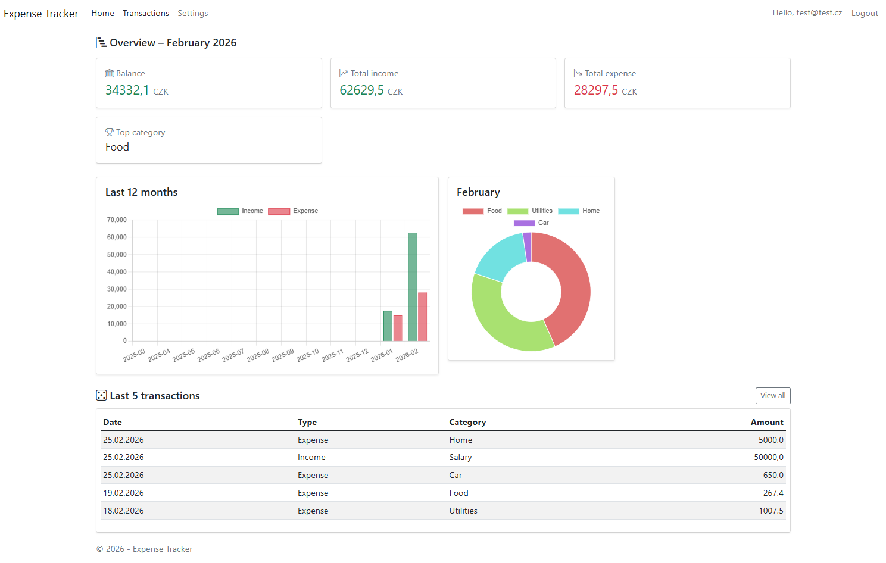
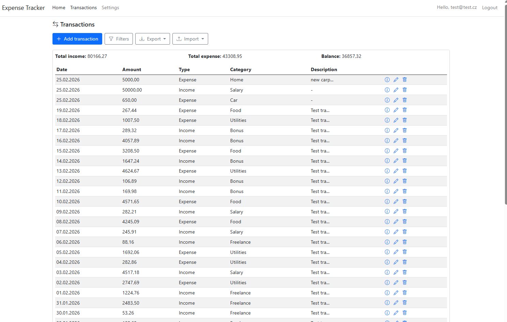
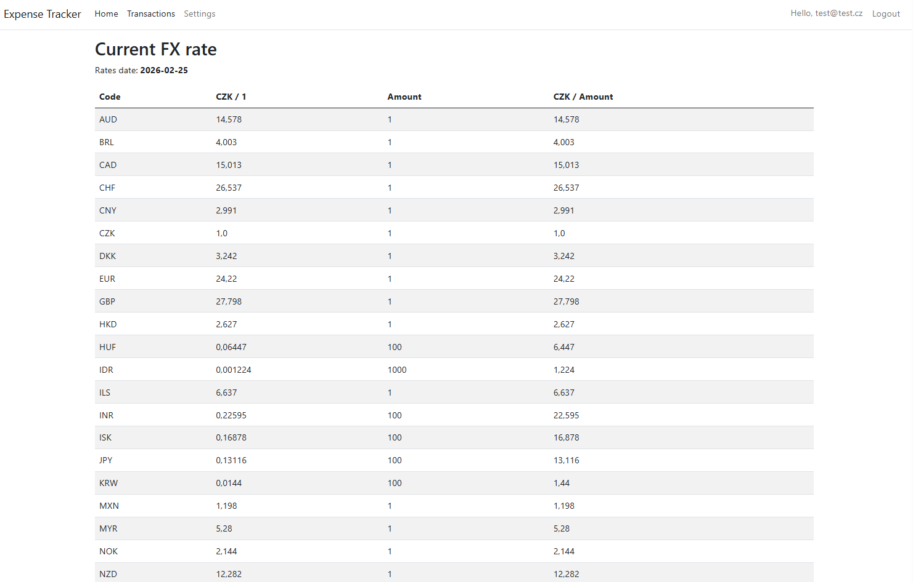

# Expense Tracker (ASP.NET Core MVC)

An ASP.NET Core MVC application for tracking personal expenses with authentication and per-user data isolation.

The application provides a monthly financial overview, transaction management, category management, export functionality, and automatic foreign exchange rate integration via the Czech National Bank (CNB).

---

## Features

- CRUD operations for transactions
- CRUD management of expense categories
- Per-user data isolation (OwnerId)
- Authentication via ASP.NET Core Identity
- Monthly overview with summary charts
- Export selected transactions to CSV / PDF
- Automatic daily FX rate download from CNB
- Persistent FX rate storage with anti-spam throttling
- Settings section for managing transaction categories and viewing current FX rates
- Simple CSV import for transactions

---

## Multi-Currency & FX Integration

The application integrates with the Czech National Bank (CNB) daily exchange rate feed:

- FX rates are automatically fetched on application startup
- Rates are stored per published date
- Weekend / holiday handling (CNB may return previous working day)
- Anti-spam protection prevents repeated downloads
- FX rate history is persisted in the database
- Current FX rates are viewable in the Settings section

Architecture highlights:
- `FxRate` entity stores published exchange rates
- `FxRateFetchLog` prevents repeated daily downloads
- Startup background service ensures daily rate availability

---

## Architecture

- MVC pattern with clear separation of concerns
- EF Core with SQLite
- Identity-based authentication
- Service layer for external integrations (CNB FX)
- Background startup task for daily FX validation

---

## Tech Stack

- ASP.NET Core MVC (.NET 8)
- Entity Framework Core
- SQLite
- ASP.NET Core Identity

---

## Project Status

Work in progress.

Core expense tracking functionality is stable.
Multi-currency foundation and FX infrastructure are implemented.
Further UI and feature enhancements are planned.

---

## Roadmap

### Short-term
- Full transaction multi-currency support
- Automatic conversion to primary currency

### Mid / Long-term
- Recurring income and expense items
- Budget tracking
- UI/UX refinement

## Dashboard Overview

  

## Transactions

  

## FX rate list

  

